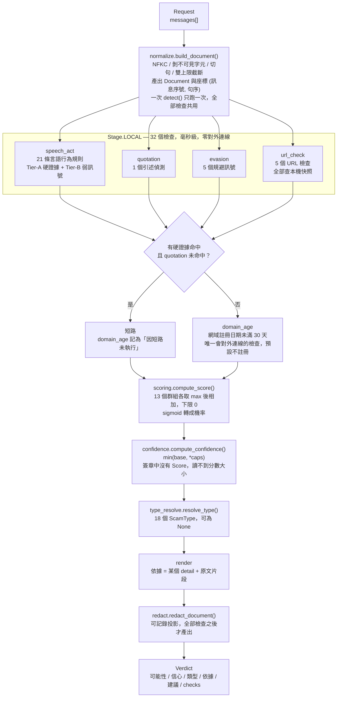
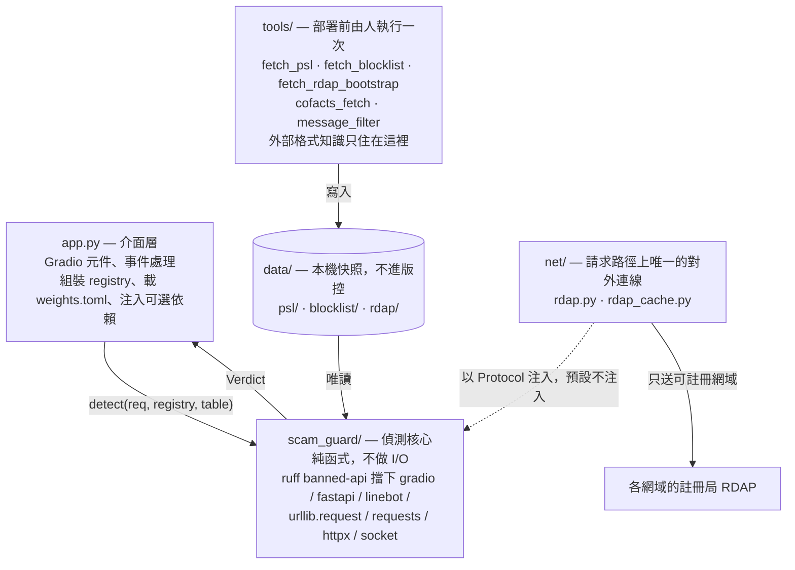

# scam-guard

台灣中文詐騙訊息偵測。
貼上一則你收到的訊息，或一整串被轉傳的對話，系統回答三件事：

1. **這是不是詐騙** —— 詐騙可能性
2. **這個判斷可不可靠** —— 信心值，與可能性是兩個獨立的量
3. **為什麼** —— 逐條依據，每一條都指回訊息裡的某一個句子

## 目的

165 打詐儀錶板累計 191,912 筆案件。現有工具多半是黑名單：要先有人受害、報案、
查證、進入開放資料，才擋得住那個網址。而釣魚網域通常在註冊後數天內被大量發送，
被通報時往往已經停用——黑名單對「正在發送的那一批」幾乎必然是空的。

這個專案補的是那段時間差：直接讀訊息的話術結構。「請至 ATM 依指示操作解除分期」
這句話不必知道任何網址就能判定，因為我國銀行不會這樣要求。

## 工程上的三個問題

| 問題 | 做法 |
|------|------|
| 判斷要可稽核 | 33 個規則檢查，每次命中產生一筆帶原文座標的 `detail`。呈現層只能組裝這些 `detail`，結構上寫不出自己的句子 |
| 不知道時要說不知道 | 詐騙可能性與信心值分開。信心不足時可能性回 `None`，不回一個數字 |
| 訊息不該外流 | 偵測核心不做 I/O，由 ruff 強制。公開 demo 用 Pyodide 跑在瀏覽器裡，訊息不離開你的裝置 |

## 專案結構

```
scam_guard/          偵測核心。純函式，不做 I/O
  types.py           Message / Request / CheckResult / Verdict / ScamType（18 類）
  check.py           Check 協定、CheckRegistry、Stage（LOCAL / EXPENSIVE）
  pipeline.py        detect() 單一入口、短路規則、quotation 否決
  normalize.py       正規化、切句、Document、座標 (訊息序號, 句序)、Limits
  rules/             speech_act.py（21 條）quotation.py evasion.py clause.py
  url.py             URL 抽取、主機正規化、可註冊網域（自解析 PSL）
  url_check.py       5 個 URL 檢查
  blocklist.py       165 黑名單本機查詢
  domain_age.py      DomainAgeLookup Protocol，實作在 net/，預設不注入
  pii.py             4 條 regex + checksum 個資辨識
  redact.py          redact_document() 產出可記錄投影
  scoring.py         加權求和、同群組取 max、引述兩段式處置
  confidence.py      min(base, *caps)，拒答地板 0.40
  type_resolve.py    類型判定，ROMANCE_INVESTMENT 合成
  render.py          依據與建議
  weights.py         weights.toml 載入與驗證
  tables/            weights.toml 與三張對照表

net/                 請求路徑上的對外查詢（rdap.py、rdap_cache.py）
tools/               部署前由人執行的取得程式（fetch_psl、fetch_blocklist…）
app.py               Gradio 介面層
```

## Demo

```bash
pip install -e ".[dev,demo]"
python app.py
```

介面有兩個模式：

- **詐騙對練** —— 你扮演詐騙方打字，受害方由系統回應，而受害方說的每一句都是
  判定結果的對話化呈現。它只會說判定裡有的東西。
- **這是詐騙嗎** —— 貼上你真的收到的訊息，輸出是判定、依據與建議動作。
  多則轉傳以**空行**分隔。

`app.py` 是介面層的唯一檔案。位置不是自由選擇：`pyproject.toml` 的 `banned-api`
對 `gradio` 的訊息已經指名它，`per-file-ignores` 也已經豁免它，而 HuggingFace
Spaces 固定執行 repo 根目錄的 `app.py`。
執行形態有兩種，程式碼同一份。上面的指令在本機跑，Python 在你的機器上；公開
demo 則以 Gradio-Lite 由 Pyodide 在**瀏覽器內**執行，靜態檔案託管於 GitHub
Pages，沒有伺服器端的 Python。`scam_guard` 進得了瀏覽器，是因為它零第三方依賴、
不碰 `sqlite3` / `socket` / `urllib`，打包成 wheel 只有 145 KB。

## 系統架構

### 一次 `detect()` 的資料流

`scam_guard.pipeline.detect()` 是唯一的偵測入口。registry、權重表與上限都由呼叫端
傳入，沒有模組層級的全域設定——消融實驗需要同時跑兩組不同設定。



三件在圖上看不出來、但決定行為的事：

- **短路只跳過 `EXPENSIVE`。** `LOCAL` 一律全跑，因為本機檢查便宜到不值得為它
  設計跳過邏輯，而完整的訊號圖像對消融實驗有用。
- **`quotation` 命中時否決短路。** 防詐宣導文命中的 Tier-A 規則比真詐騙還多
  （「本行絕不會要求您至 ATM 操作」一句同時命中三條），照一般短路邏輯會直接誤判。
- **`confidence` 低於 0.40 時 `scam_probability` 是 `None`。** `confidence` 一律
  填實際值，讓呼叫端看得到系統為什麼閉嘴。

### 架構界線

界線畫在「誰知道外部世界」。`tools/` 在部署前由人執行一次，失敗人看得到；
`net/` 在每次請求的路徑上，失敗必須被檢查自己吞掉並轉成「沒有訊號」。



`scam_guard/blocklist.py` 只認識一個我們自己定義的格式（`entries.jsonl` 加
`manifest.json`）。data.gov.tw 的下載網址、中文欄位名稱、UTF-8 BOM、民國紀年全部
留在 `tools/`。理由是資料集改版時會壞在哪裡：若核心知道欄位叫什麼，改版會在一個
線上請求裡拋 `KeyError`，而 `Check` 協定要求檢查自行吞例外回傳空陣列——黑名單
會安靜地變成空的。一個看起來正常、但硬證據永遠不命中的系統最難發現。

### 本機比對與對外查詢

| 檢查 | 資料來源 | 對外連線 |
|------|----------|----------|
| 21 條言語行為規則 | 程式碼內的述語詞表 | 無 |
| 1 個引述偵測 | 程式碼內的引述標記 | 無 |
| 5 個規避訊號 | 程式碼內的字元清單 | 無 |
| `url_blocklist` | `data/blocklist/`，107,499 筆 | 無 |
| `url_shortener` / `url_tld_risk` / `url_brand` | `scam_guard/tables/*.json` | 無 |
| `url_host_shape` | `data/psl/` Public Suffix List | 無 |
| `domain_age` | 各網域註冊局的 RDAP | **有，且預設不註冊** |

黑名單快照由三個 data.gov.tw 資料集合併，原始共 130,193 筆，以「每個來源的每個
唯一主機一筆」落地後為 107,499 筆、106,596 個唯一主機：

| | 176455 | 160055 | 165027 |
|---|---|---|---|
| 內容 | 遭停止解析涉詐網站 | 假投資(博弈)網站 | 聲請停止解析網址清單 |
| 機關 | 內政部警政署 | 內政部警政署 | 數位發展部數位產業署 |
| 原始筆數 | 83,323 | 45,258 | 1,612 |
| 落地筆數 | 75,641 | 30,285 | 1,573 |
| 資料截至 | 2026-08-31 | 2025-12-31（已停更） | 2026-08-26 |

新鮮度以 `data_through` 判定，不以 `fetched_at`：160055 的詮釋資料 2026-07-29 還
更新過，但檔案內最新一筆停在 2025-12-31。

## 設計原則

### 能用規則判的不叫 LLM

33 個檢查全部是規則。`Stage.LOCAL` 的 32 個在毫秒內跑完、零對外連線，每次命中都
附一個可回指原文座標的 `detail`；規則不生成任何字，所以不會幻覺。

這也是部署條件逼出來的。公開 demo 走 GitHub Pages + Gradio-Lite，而 GitHub Pages
是純靜態託管——沒有伺服器可以跑 Python，`scam_guard` 是在使用者的瀏覽器裡由
Pyodide 執行的。規則層在那裡跑得動；LLM 層跑不動，`llama-cpp-python` 沒有 Pyodide
版本。`project.md` 早就把 LLM 層定成可插拔、未掛載時降級為純規則版，那條降級路徑
因此不是備案，是公開 demo 的實際形態。

### 可能性與信心是兩個獨立的量

```
詐騙可能性  0.87        信心不足時為 None，呼叫端顯示「無法判定」
信心值      0.90        這一則判定有沒有足夠依據，不是準確率
```

分數 0.5 有兩種來源：訊號互相矛盾，與完全沒有訊號。兩者都沒有依據下判斷，所以
兩者信心都低。**不用紅黃綠三級**——「可能性 0.9、信心 0.9」與「可能性 0.9、
信心 0.2」在三級制裡是同一個紅色，而它們是兩件不同的事。

這條由簽章守住：`compute_confidence()` 不接收 `Score`。「分數高所以信心高」在語意
上是錯的——一則命中五條 Tier-B 的宣導文分數很高，依據卻很弱。

### 依據是組裝的，不是生成的

```
依據行 = detail  [+ 一段取自 doc.raw_at(coord) 的原文片段]
```

可測形式：對每一行依據，去掉原文片段之後必須等於某個 `hit=True` 結果的 `detail`。
一個會自己寫句子的呈現層可以寫出「此網域註冊於 6 天前，屬高風險」——前半來自
`detail`，後半是它自己加的，而沒有任何地方會報告它。

禁的是宣告與推測，不是用字：「可疑」「危險」要求使用者相信我們，「這個網域 6 天前
才註冊」給了使用者能自己判斷的東西。而「evil.com 於 2026-08 列入 165 反詐騙諮詢
專線_遭停止解析涉詐網站」含「詐」字，它是可查證的引用，是依據的範本。

### 誤判率是驗收指標，不是心願

`confidence` 的第三級（恰好命中一個群組）是 0.35，刻意低於門檻 0.40。後果是只命中
一條 Tier-B 的訊息一律拒答，棄權率因此提高。理由是「高薪日結免經驗」「保證獲利」
在合法的打工與理財廣告裡大量出現。

同一個判斷也在計分層：分數下限為 0，系統不宣稱「這不是詐騙」。合法訊息的特徵是
**沒有**詐騙特徵，那是證據不存在，不是反向證據存在。代價是可能性的值域只有
`[0.5, 1)`。

### 查不到就是查不到

- `domain_age` 的三種結果（查到、查到但沒有建立日期、問不到）在型別上分開。把
  「問不到」當成「沒有訊號」，會讓一個全新的釣魚網域與一個十年老網域在下游完全
  同形。
- 計分層遇到未登錄於權重表的訊號讓 `KeyError` 傳播，不以 0 權重略過——一個沒有
  權重的訊號悄悄不計分，等於少一個證據而沒有地方會說。
- 呈現層遇到越界座標讓 `KeyError` 傳播——吞掉的話，一個算錯座標的檢查只會變成少
  一行依據，沒有人會發現。
- 權重表在組裝階段就驗證 registry，不延後到第一次查表。

## 現況與限制

**規則層在真實語料上幾乎沒有鑑別力。** 對 Cofacts 開發樣本 1,200 則，以 21 條言語
行為規則 + 5 個規避訊號 + 1 個引述偵測逐標籤實測（不含 URL 層與 `domain_age`）：

| 標籤 | n | 任何命中 | 硬證據命中 |
|------|---|----------|------------|
| scam（社群查核為詐騙） | 600 | 36（6.0%） | 1（0.2%） |
| hard-negative（政策宣導／商業廣告） | 600 | 33（5.5%） | 1（0.2%） |

**兩列只差 0.5 個百分點。** 召回率低只是表面，真正的問題是規則在詐騙與非詐騙上
命中得幾乎一樣多，在這份語料上分不開兩者。只看正例那一列會以為調高召回就能解決，
但再加規則若同時抬高兩列，鑑別力不會變。

原因是語料的形狀。規則寫的是「合法機構不可能送出的言語行為」，而 Cofacts 上流傳的
詐騙大量是一頁式購物廣告、投資群組邀請、無話術的純連結，規則層對它們結構上就不該
命中；另一側的政策宣導文則大量轉述詐騙話術，命中的正是同一批規則。這同時說明了
`quotation` 的否決短路為什麼必要，以及 LLM 層要補的是哪一個洞。

上表是一次實測，不是驗收數據：檢查集不含黑名單，而黑名單是系統裡最強的硬證據來源。
正式的混淆矩陣與 Wilson 區間屬 `add-metrics`，尚未落地。

**LLM 層尚未落地，而且進不了公開 demo。** `add-llm-client` / `add-llm-prompt` /
`add-llm-schema` / `add-llm-validate` 都還在 `openspec/changes/`，程式碼裡沒有任何
模型呼叫。即使落地，它也上不了 Gradio-Lite 那條路徑：Pyodide 跑不動
`llama-cpp-python`。完整版要在本機或一台真的有 Python runtime 的機器上跑。目前
`Stage.EXPENSIVE` 只有 `domain_age` 一個檢查。

**「跑了但問不到」說得出來了，但還沒有人讀。** `add-indeterminate-outcome` 已合併：
`CheckResult` 多了 `indeterminate` 這個正交的第二軸，`domain_age` 的 `NO_DATA` 與
`UNAVAILABLE` 因此各產出一筆 `hit=False, indeterminate=True` 的結果。但
`confidence.py` 目前還沒有讀它（`cap_indeterminate` 屬後續的 scoring PR），所以
後果沒變：RDAP 失敗時信心值仍然偏高。

**`.tw` 網域拿不到註冊日期。** TWNIC 的端點確實提供 `registration` 事件（以 HTTP/2
查 `esunbank.com.tw` 得到 `1997-05-01T03:57:36Z`），但它對 HTTP/1.1 回
`426 Upgrade Required`，而 `net/` 只用標準庫，`urllib` 不支援 HTTP/2。在不引入
HTTP/2 客戶端之前，這個訊號在 `.tw` 上是空的——而 `.tw` 正是台灣詐騙網域最相關的
那一個。

**誤判率門檻還沒被量過。** 目標是誤判率的 Wilson 95% 上界 ≤ 2%。零誤判時 Wilson
上界化簡為 `z² / (n + z²)`，只依賴 n：`n = 149` 給的是 2.51%，要 ≤ 2% 需要
**189 則** hard negative。專案早期文件四處寫的「149 則」是 rule of three
（`3/149 = 2.01%`）的數字，不是 Wilson 的。這批人工標註樣本目前還不存在。

**全部權重與門檻都是佔位值。** `weights.toml` 的 60 處 `basis` 全是 `"placeholder"`，
`blocked_on = "add-testset"`。因此可能性只保證單調（證據愈強愈大），不保證校準。

**類型涵蓋 165 的 67.6%。** `ScamType` 有 18 個成員，對應 191,912 筆案件中的 20 個
`CaseTitle`，合計 129,753 件。明確排除 5 類（網路購物、假廣告、信用卡遭盜刷、假預付
型消費、其他，57,387 件、29.9%），因為它們的判定要件不在訊息裡——一則「您的訂單有
誤」單看訊息無法分辨真假。另有約 29% 的案件（假投資、假交友）前期訊息全部無害，
需要長期軌跡追蹤。兩組互不重疊。

**個資辨識的 precision 是 82.3%，而這個數字要跟兩件事一起讀。** 四條辨識器在
tw-PII-bench（910 題，`scripts/bench_pii_regex.py`，2026-09-14）上命中 814 筆，
其中 670 筆與同類 gold 重疊：

| 類型 | 命中 | 同類 gold | 嚴格 precision | 誤遮（無任何 gold 重疊） |
|------|------|-----------|----------------|--------------------------|
| `TW_ID` | 200 | 110 | 55.0% | 2 |
| `TW_MOBILE` | 528 | 509 | 96.4% | 18 |
| `TW_LANDLINE` | 85 | 51 | 60.0% | 34 |
| `CREDIT_CARD` | 1 | 0 | 0.0% | 0 |
| **整體** | **814** | **670** | **82.3%** | **54** |

一，**54 筆「誤遮」已逐一人工檢視，全部是資料集未標註的真電話或真證號**（公司
客服專線、住家電話、分機前的市話）——在本語料上遮到非個資的次數是**零**。
二，**814 − 670 = 144 筆差額全是標籤錯位**：`TW_ID` 的多數「誤判」是駕照號碼與
軍人補給證號，它們與國民身分證共用 `[A-Z][12]\d{8}` 的形狀並通過**同一個**
checksum，在字元層不可區分。標到它們標到的確實是個資，只是類型標籤說錯了。
`TW_ID` recall 36.2% 是同一件事的另一面：資料集把同形狀的證號拆成
`tw_national_id` / `tw_driver_license` / `tw_military_id` 三個標籤，我們只認第一個。

**這些數字不進產品畫面。** 介面的讀者是一個收到可疑訊息、想知道該不該照做的人，
「嚴格 precision」與「標籤錯位」對那個讀者是雜訊；畫面上只講一句「能認出四類，
姓名與地址不在裡面」。一個直接的後果是類型標籤的措辭：`TW_ID` 顯示為
「身分證字號」而不是「國民身分證」，因為後者是字元層支持不了的排他宣稱。

**規模。** 程式碼 9,792 行（`scam_guard/` + `net/` + `tools/` + `app.py`），測試
9,247 行、37 個檔案，全部不需要網路。`weights.toml` 登記 51 個條目（33 個訊號 +
18 個類型）。

## REST API

```bash
pip install -e ".[dev,api]"
uvicorn api.app:app --host 127.0.0.1 --port 8000
```

兩個端點：`POST /check` 與 `GET /health`，欄位說明在 `/docs`。

```bash
curl -s localhost:8000/check -H 'content-type: application/json' \
  -d '{"messages":[{"text":"您好，我是警察...","from":"them","at":"2026-09-14T10:00:00Z"}]}'
```

`POST /check` **一律回 200，包含拒答** —— 拒答是系統正確地判斷自己沒有足夠
依據，那是一次成功的推論不是一次失敗。請讀 `abstained` 這個布林欄位，
**不要對 `scam_probability` 做數值比較**：它在拒答時是 `null`，而
`null > 0.5` 在 JavaScript 裡靜靜地是 `false`，於是「系統沒把握」會被讀成
「不是詐騙」。

`evidence` 的每一行**可能含請求中訊息的原文片段**（規則層的依據多半以一段引自
原文的句子作為可查證性的來源）。本服務不記錄它，呼叫端也不應該記錄。

回應不含證據座標、不含逐項檢查記錄、不含可記錄投影。座標不送的理由不是隱私，
是送了也解不對：解析座標需要 `Document`，而它在請求結束時就消失了。

### 部署層要求

**本服務 MUST NOT 在沒有網路層存取控制的情況下直接公開暴露。**

它不做認證、不做速率限制、也不做 API 版本協商，三者都是刻意的：在應用層發明
一套 token 格式是在為一個還沒有需求的東西寫程式碼。但風險是真的 ——
一個無認證的公開端點是一個免費的「這則訊息是不是詐騙」神諭，詐騙方可以拿它
逐句調整話術直到分數掉下門檻。所以這一條記為**部署層**的要求（反向代理的
存取控制、內網、或 mTLS），而不是假裝應用層擋住了。

`GET /health` 的 `weights.path` 會揭露伺服器上的絕對路徑，前提也是同一條。

### 未預期例外的回應形狀不一樣

`POST /check` 的錯誤回應是 `{"error": {"code", "field", "message"}}`，
但**未預期例外（500）不是這個形狀** —— 那條路徑交給 ASGI 框架的預設行為，
回一個不含 traceback 的純文字 500。本專案禁止 `except Exception`，
而 `@app.exception_handler(Exception)` 在效果上就是它。

呼叫端因此必須把「非 2xx 且非 `ErrorResponse` 形狀」當成一個獨立的失敗分支，
不能假設全部錯誤都解析得出來。這條路徑理論上不該被觸發：觸發即代表
`Check.__call__` 的協定（「依賴外部服務的檢查 MUST 自行捕捉例外」）被破壞了。
## 這個系統會不會把你的訊息送出去

**預設不會。** 訊息的正規化、切句、規則比對、165 涉詐網址黑名單比對、
TLD 風險、品牌相似度全部在本機完成，用的是預先下載好的本機快照。

**唯一的例外是網域年齡檢查（`domain_age`），而它預設不啟用。**
啟用它需要組裝層顯式注入一個查詢器（`net.rdap.RdapLookup`）；
不注入時系統照常運作，只是少一個訊號。

啟用之後會發生的事，逐項列舉：

- 訊息中每個連結的**可註冊網域**（例如 `https://login-esunbank.evil.com/a?token=abc`
  只取 `evil.com`）會被送到**該網域的註冊局**，查詢它的註冊日期。
- **不送**完整網址、路徑、query 參數、主機的子網域、訊息內容，
  也不送任何可識別你的資訊。
- 已知短網址服務的網域（`reurl.cc`、`bit.ly` 等）**不查詢**。
- 黑名單已命中時**不查詢** —— 最可疑的那批網域反而不會外流。
- 查過的網域會存進本機的 SQLite 快取（預設 `data/rdap/cache.sqlite3`），
  7 天內不重複查。清除用 `python -m tools.prune_rdap_cache`。

註冊局（以及網路路徑上的觀察者）因此會知道「某個 IP 在某個時間查了這個網域」。
它學不到是誰收到訊息、訊息內容是什麼、系統最後判成什麼。這比展開短網址
少非常多，但它不是零 —— 所以這個檢查預設關閉，開啟它是一個要顯式做的決定。
**瀏覽器內執行讓這一節更強。** 公開 demo 沒有伺服器：Pyodide 在使用者的瀏覽器裡
執行 `scam_guard`，訊息連一次伺服器都沒有到過，上面的「預設不會送出」從一個承諾
變成一個結構事實——沒有可以送到的地方。代價是 `domain_age` 在那條路徑上也不可能
啟用，Pyodide 沒有 `socket`，而該檢查的實作 `net/rdap.py` 要用它。

個資遮蔽的位置也是同一個推論的產物：遮蔽只在**寫入 log 之前**套用，不在呼叫模型
之前。模型與介面同程序，未遮蔽的原文與模型在同一塊記憶體裡，對模型遮蔽保護不了
任何東西；而 log 長期保存、事後可能被人翻閱，那才是真正的外流面。
`Verdict.redacted` 是取得可記錄投影的唯一途徑，HTTP 回應與 UI 不得顯示它。

## 開發

```bash
python3 -m pytest -q        # 全部測試，不需要網路
python3 -m ruff check .     # lint，含架構界線（scam_guard/ 不得 import 網路函式庫）
```

`tests/test_gradio_demo.py` 以 `pytest.importorskip("gradio")` 開頭，本機沒裝
`[demo]` extra 時整個檔案會被跳過。CI 因此安裝 `.[dev,demo]` —— skipped 不會讓
CI 變紅，安靜跳過的測試等於沒有測試。

部署前需要的本機快照：

```bash
python -m tools.fetch_psl                # Public Suffix List
python -m tools.fetch_blocklist          # 165 涉詐網址黑名單
python -m tools.fetch_rdap_bootstrap     # IANA RDAP 端點對照（僅啟用 domain_age 時需要）
```

## 授權

本專案為 MIT（見 `LICENSE`）。

**例外：`demo_samples.json` 的內容為 CC BY-SA 4.0。** 該檔的訊息取自
[Cofacts 真的假的](https://cofacts.tw) 的開放資料，姓名標示以每一筆的
`source_uri` 滿足。散布該檔或其衍生內容時須以相同條款釋出，不適用本專案的 MIT。
