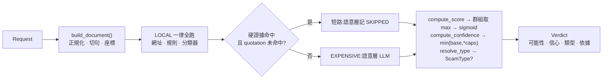

# scam-guard

台灣中文詐騙訊息偵測。輸入一則訊息(或一整串轉傳對話),輸出三件事:

1. **是不是詐騙** — 詐騙可能性(`scam_probability`)
2. **判斷可不可靠** — 信心值(`confidence`),與可能性是兩個獨立的量
3. **為什麼** — 逐條依據,每條指回訊息裡的某個句子

## 架構

`scam_guard.pipeline.detect()` 是唯一入口。registry、權重表、上限都由呼叫端傳入,無模組層級全域狀態。

四層偵測,由便宜到昂貴(命名為兩個 `Stage`):

| 層 | 檢查 | 訊號 | Stage |
|----|------|------|-------|
| 網址 | `url_blocklist`(165 黑名單)· shortener · tld · host · brand | 黑名單確切命中為硬證據,其餘軟 | LOCAL |
| 規則 | `speech_act`(21 條)· `evasion`(5)· `quotation` | Tier-A 硬 / Tier-B 軟 | LOCAL |
| 分類器 | `ngram_classifier`(char_wb TF-IDF + LR,零依賴推論) | strong | LOCAL |
| 語意 | `llm_scam` / `llm_suspicious`(GBNF/responseSchema 結構化輸出) | strong | EXPENSIVE |



關鍵行為:

- **短路只跳過 `EXPENSIVE`**;LOCAL 一律全跑。
- **`quotation` 命中否決短路** — 防詐宣導文命中的 Tier-A 規則常比真詐騙多。
- **可能性與信心是兩個獨立的量**:`compute_confidence()` 不接收 `Score`。信心 < `0.40` 時 `scam_probability` 回 `None`(棄權)。
- **依據是組裝的,不是生成的**:每行依據 = 某個 `hit=True` 結果的 `detail`(+ 原文片段),呈現層不自己寫句子。
- **查不到就是查不到**:未登錄權重、越界座標、RDAP 問不到都不吞成 0/空,分開處理或讓 `KeyError` 傳播。

### 架構界線(ruff banned-api 強制)

`scam_guard/` 是純函式偵測核心,不做 I/O、不得 import `gradio`/`fastapi`/`linebot`/`urllib`/`socket` 等。介面層在 `app.py`、`api/`、`clients/`;請求路徑上的對外查詢在 `net/`;部署前取得資料在 `tools/`;雲端 LLM runtime 在 `llm_runtime/`。

```
scam_guard/     偵測核心(純函式):pipeline · rules/ · url* · ngram · scoring · confidence · llm/ · tables/
llm_runtime/    LLM runtime:gemini.py(雲端)· llama_cpp_runtime.py(本機)
api/            REST(FastAPI)· clients/line/ LINE webhook · clients/web/ 單一伺服器 web demo
net/ tools/     RDAP 查詢 · 部署前資料取得
app.py          Gradio 介面
```

## 執行形態

同一份 `scam_guard`,四種介面。有 `GEMINI_API_KEY` 時語意層走 Gemini;沒有則降級為純規則(三層)。

| 介面 | 指令 | 語意層 |
|------|------|--------|
| 瀏覽器 demo | GitHub Pages + Pyodide(靜態,無伺服器) | 裝置內 transformers.js |
| Gradio | `python app.py`(:7860) | Gemini |
| REST API | `uvicorn api.app:app --port 8000` | Gemini |
| web demo | `uvicorn clients.web.app:app --port 8100`(沿用 Pages 版面) | Gemini |
| LINE bot | `uvicorn clients.line.app:app --port 8000` | Gemini |

## 本地部署(伺服器端 + Cloudflare)

```bash
pip install -e ".[dev,demo,api,line,web]"
```

機密放 gitignored 的 `.env`(**勿進版控 / 勿上 GitHub**):

```bash
# .env
GEMINI_API_KEY=<你的 Gemini API key>
GEMINI_MODEL=gemini-3.5-flash-lite
LINE_CHANNEL_SECRET=<你的 channel secret>
LINE_CHANNEL_ACCESS_TOKEN=<你的 channel access token>
```

啟動(以 Gradio 為例;`.env` 提供 Gemini 金鑰):

```bash
set -a; . ./.env; set +a
python app.py                                    # Gradio :7860
cloudflared tunnel --url http://localhost:7860   # 免網域,印出 https://<隨機>.trycloudflare.com
```

`cloudflared` quick tunnel 的網址是**臨時**的,process 存活期間不變,重啟即換。
要同時開多個 tunnel,各加 `--metrics 127.0.0.1:<埠>`,並可用
`curl -s http://127.0.0.1:<埠>/quicktunnel` 取回目前網址。

### LINE bot:啟動後要設定 webhook

1. 起 LINE server 與 tunnel:
   ```bash
   uvicorn clients.line.app:app --port 8000
   cloudflared tunnel --url http://localhost:8000
   ```
2. LINE Developers Console → 你的 channel → Messaging API → **Webhook URL** 填
   `https://<tunnel>.trycloudflare.com/callback`,按 **Verify**(應回 200),並開啟 **Use webhook**。
3. tunnel 網址每次重啟會變,**重啟後要回來改這個 Webhook URL**。

### 可用的 Gemini 模型(文字 / 結構化輸出)

適用本專案(`generateContent` + JSON schema)的是 flash / flash-lite 家族,由 `GEMINI_MODEL` 選:

- `gemini-3.5-flash-lite`(預設,免費層每日請求數最寬)
- `gemini-flash-lite-latest` / `gemini-flash-latest`(自動追最新)
- `gemini-3.5-flash` · `gemini-3.6-flash` · `gemini-3.8-flash`(較強,免費層額度較低)
- `gemini-2.5-flash-lite` · `gemini-2.5-flash`(較舊、穩定)

查目前金鑰可用的完整清單:
```bash
curl -s "https://generativelanguage.googleapis.com/v1beta/models?key=$GEMINI_API_KEY" \
  | python3 -c "import sys,json;[print(m['name'][7:]) for m in json.load(sys.stdin)['models'] if 'generateContent' in m['supportedGenerationMethods']]"
```

## REST API

```bash
uvicorn api.app:app --port 8000     # 端點 POST /check · GET /health,欄位見 /docs
curl -s localhost:8000/check -H 'content-type: application/json' \
  -d '{"messages":[{"text":"您好我是警察...","from":"them","at":"2026-09-14T10:00:00Z"}]}'
```

- `POST /check` **一律回 200,含棄權**。讀 `abstained` 布林,**勿對 `scam_probability` 做數值比較**(棄權時為 `null`)。
- `evidence` 可能含原文片段;本服務不記錄,呼叫端也不應記錄。
- **未經網路層存取控制不得公開暴露**:無認證、無限流(刻意)。公開端點等於免費的詐騙話術調參神諭。

## 開發

```bash
python3 -m pytest -q        # 全部測試,不需網路
python3 -m ruff check .     # lint,含架構界線
```

部署前本機快照:`python -m tools.fetch_psl` · `tools.fetch_blocklist` · `tools.fetch_rdap_bootstrap`(僅 `domain_age` 需要)。

## 現況

- **語意層(LLM)已接上**:伺服器端(Gradio / API / LINE / web)透過 `llm_runtime/gemini.py` 走 Gemini;瀏覽器 demo 走裝置內 transformers.js。失敗即整體判定失敗(不給降級判定),介面顯示「語意判讀失敗」。
- **權重多為佔位值**:`weights.toml` 多數 `basis="placeholder"`,可能性只保證單調、不保證校準;完整測試集評測(Wilson 區間、混淆矩陣)進行中。
- **`domain_age` 預設不啟用**(唯一對外連線);`.tw` 網域受限於 RDAP 只走 HTTP/2 而 `net/` 只用標準庫。

## 授權

MIT(見 `LICENSE`)。**例外**:`demo_samples.json` 內容為 CC BY-SA 4.0(取自 [Cofacts](https://cofacts.tw) 開放資料),散布其衍生內容須以相同條款釋出。
